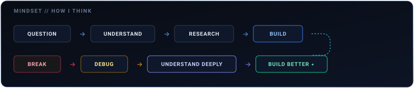
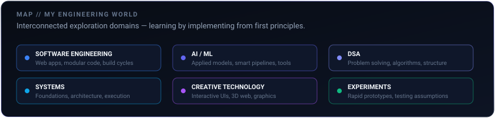
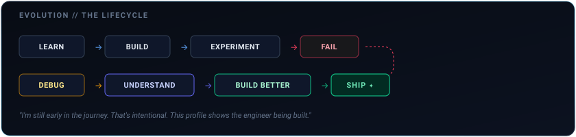

<div align="center">

# PRANJALI SANTANI

### Building my engineering world.

`CSE` · `SOFTWARE ENGINEERING` · `AI/ML`

**LEARN → BUILD → BREAK → UNDERSTAND → SHIP**

<br/>


</div>

<br/>

---

### `$ whoami`

```zsh
❯ pranjali --status
Computer Science Engineering student exploring software engineering, AI/ML, 
systems, and creative technology through building.
```

I explore how software works from first principles. Rather than just making things work on the surface, I build to understand—and when something breaks, that's where the actual engineering starts.

<br/>

---

### How I Think

<p align="center">
  
</p>

<br/>

---

### Currently Building

*What I am actively exploring through code:*

- **Software Engineering** — Modular applications, clean component architecture, and responsive interfaces.
- **AI / ML** — Applied models, anomaly detection, and intelligent tools.
- **Systems & Foundations** — Exploring how software works under the hood, performance, memory, and architecture trade-offs.
- **Data Structures & Algorithms** — Algorithmic thinking, problem-solving, and efficiency.
- **Creative Technology** — Interactive graphics, 3D web experiences, and kinetic UI.

<br/>

---

### My Engineering World

<p align="center">
  
</p>

<br/>

---

### Proof of Work

*Projects reflecting milestones in my learning journey. Team and fork provenance preserved.*

#### 1. `acm-2026-digital-experience`
- **Focus:** Modern, interactive and network-driven chapter web presence.
- **Stack:** TypeScript, Modern Web UI.
- **What I explored:** Modern frontend structure, responsive layouts, and interactive web design.
- **Project context:** Public chapter website project.

#### 2. `acm-student-chapter`
- **Focus:** Community platform featuring interactive elements and 3D web graphics.
- **Stack:** JavaScript, Three.js, WebGL.
- **What I explored:** Three.js integration, interactive UI, and web-based community experiences.
- **Project context:** Student chapter web portal.

#### 3. `CodeRush2.0_PromptArchitects`
- **Focus:** AI-powered civic intelligence & public safety platform concept for smart cities.
- **Team / fork provenance:** Team PromptArchitects, CodeRush 2.0 Global Hackathon. Fork provenance preserved.
- **What I explored:** Hackathon collaboration, civic reporting workflows, and applied AI interface concepts.

#### 4. `Data_Driven_Water_Quality_Surveilance_And_Loss_Detection_System`
- **Focus:** IoT and sensor-driven real-time water quality monitoring and anomaly detection.
- **Stack:** Python, Jupyter Notebook, Sensor Analytics.
- **Team / fork provenance:** Academic collaborative project (fork provenance preserved).
- **What I explored:** Data analysis in Jupyter notebooks, anomaly patterns, and sensor data pipelines.

#### 5. `SunConnect`
- **Focus:** Clean technology & energy monitoring web concept.
- **Stack:** HTML, CSS, JavaScript.
- **Team / fork provenance:** Academic team project (fork provenance preserved).
- **What I explored:** Early web development foundations and collaborative project workflow.

<br/>

---

### AI × My Workflow

<p align="center">
  
</p>

AI accelerates my research and iteration, but true engineering comes from understanding the details and owning the code.

<br/>

---

### The Journey

<p align="center">
  
</p>

> *I'm still early in the journey. That's intentional.*  
> *This profile shows the engineer being built.*

<br/>

---

<div align="center">

### Still building the answer.

</div>
