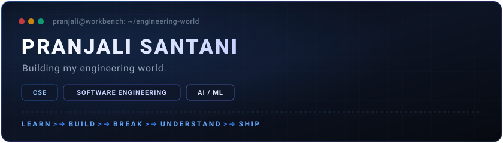
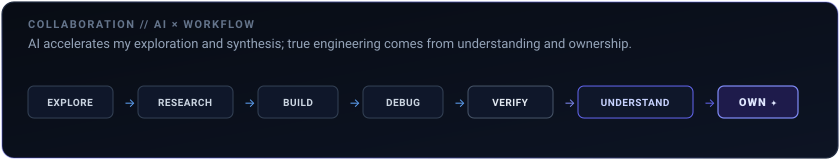

# PRANJALI SANTANI

### Building my engineering world.

`CSE` · `SOFTWARE ENGINEERING` · `AI/ML` &nbsp;|&nbsp; **LEARN → BUILD → BREAK → UNDERSTAND → SHIP**

 

 

### Currently Building

- **Software Engineering** — Modular architecture, clean patterns, and responsive interfaces.
- **AI / ML** — Applied models, anomaly detection, and intelligent tools.
- **Systems & Foundations** — Software fundamentals, performance, memory, and architecture trade-offs.
- **DSA** — Algorithmic problem-solving, data structures, and efficiency.
- **Creative Technology** — Interactive graphics, 3D web experiences, and kinetic UI.

 

### Selected Work

- **[`acm-2026-digital-experience`](https://github.com/pranjalisantani/acm-2026-digital-experience)** — Modern, interactive chapter web presence exploring frontend structure and responsive design. `TypeScript`
- **[`acm-student-chapter`](https://github.com/pranjalisantani/acm-student-chapter)** — Interactive student chapter portal exploring Three.js web graphics and community UI. `JavaScript`
- **[`CodeRush2.0_PromptArchitects`](https://github.com/pranjalisantani/CodeRush2.0_PromptArchitects)** — AI-powered civic intelligence & public safety platform concept for smart cities. *(Team PromptArchitects, CodeRush 2.0 Global Hackathon. Fork provenance preserved)*
- **[`Data_Driven_Water_Quality_Surveilance_And_Loss_Detection_System`](https://github.com/pranjalisantani/Data_Driven_Water_Quality_Surveilance_And_Loss_Detection_System)** — IoT & sensor-driven water quality monitoring and anomaly detection. `Python` *(Academic collaborative project. Fork provenance preserved)*
- **[`SunConnect`](https://github.com/pranjalisantani/SunConnect)** — Clean technology & energy monitoring web concept exploring early web foundations. `HTML/JS` *(Academic team project. Fork provenance preserved)*

 

### Contribution Trail 🐍

  

 

### AI × Workflow

  

AI accelerates exploration and iteration, but true engineering comes from deep understanding and ownership.

 

*Still building the answer.*

